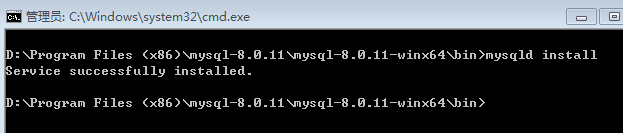

##### 1.解压压缩包

##### 2.配置my.ini文件

在bin目录的同级目录下新建一个配置文件，文件名叫my.ini，然后把下面的配置代码复制到在my.ini（代码中的路径要改成自己的文件存放路径）

```
[mysql]
# 设置mysql客户端默认字符集
default-character-set=utf8 
[mysqld]
#设置3306端口
port = 3306 
# 设置mysql的安装目录
basedir=D:\Program Files (x86)\mysql-8.0.11\mysql-8.0.11-winx64
# 设置mysql数据库的数据的存放目录
datadir=D:\Program Files (x86)\mysql-8.0.11\mysql-8.0.11-winx64\data
# 允许最大连接数
max_connections=200
# 服务端使用的字符集默认为8比特编码的latin1字符集
character-set-server=utf8
# 创建新表时将使用的默认存储引擎
default-storage-engine=INNODB
```

##### 3.安装mysql服务

在mysql的bin目录下  用管理员身份打开CMD窗口，输入mysqld install回车运行就行 ,安装成功如图所示： 



##### 4.开启mysql服务

控制面板->管理工具->服务->mysql->启动。 

至此，可以使用mysql服务了。在安装后，启动过程中，要是出现1066的错误，就是因为my.ini配置的问题，着重去看看my.ini里面的路径有没有修改成自己的路径。

在输入命令mysql -uroot -p连接数据库时会提示输入密码，root的密码默认为空，直接按回车就行了。


接下来就是登陆: 

```
mysql -u root -p
```

因为密码为空，直接再空格就OK了。 


tip：data目录下的.err结尾的文件中有用户名及密码


#### 异常情况

##### 在启动mysql服务时出现该错误:  本地计算机上的mysql服务启动停止后,某些服务在未由其他服务或程序使用时将自动停止。 

###### 1.首先，你需要把原来的服务删除： 

```
mysqld --remove mysql
```

mysql为你的服务名称，自己可以随便定义的。  此命令需要进入mysql安装目录下的bin目录运行 

###### 2.你需要清空data目录。

mysql的根目录下：如果没有data目录，请自行创建一个空目录，起名为data！

然后在bin目录下运行命令:

```
mysqld --initialize-insecure --user=mysql
```

接下来继续走安装流程3、4即可


##### Navicat for MySQL： 

###### Client does not support authentication protocol requested by server; consider upgrading MySQL client 

不支持无密码连接,需用命令行进入mysql设置密码如下:

```
mysql> alter user 'root'@'localhost' identified with mysql_native_password by '123456';
Query OK, 0 rows affected (0.10 sec)

mysql> flush privileges;
Query OK, 0 rows affected (0.01 sec)
```
